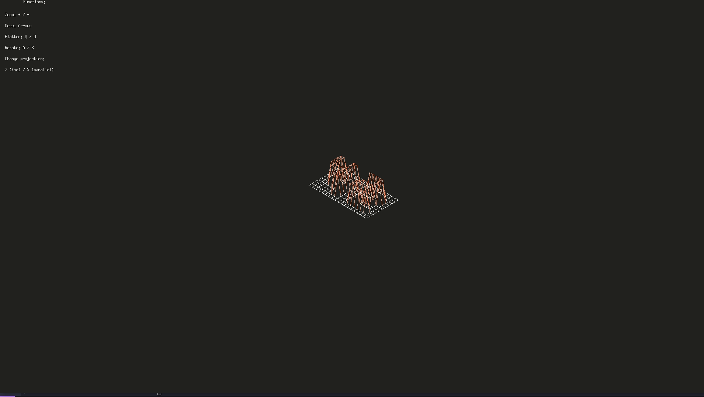

# 42-FDF

<b>Description:</b> This project is about representing a landscape as a 3D object
in which all surfaces are outlined in lines.

[Julia's Log for FDF](https://docs.google.com/document/d/16hnRGu7BTQ3G_DEv8pheJwB2bXY29A-U6x1XOxjs98M/edit?usp=sharing)

> *Personal Note:*
This was a very interesting process. I decided to start FDF
for getting excited looking at all maps people make and show on their github.
As someone originally from the social sciences and that usually said that math
is not for me, I also wanted to prove myself that I could actually do a project
with plenty of math involved. I started this project in August 2021, working
part-time. I would never think it would take so much time to finish it.
I have worked on this until October 2020, when I got stuck and decided to go
for other projects. After finishing them, I even decided to start a different
graphic project, an less math-demanding one, but thought about taking a final
look at this unfinished project. Turns out, I understood what I was doing wrong
at that time and finally made my mind into dedicating myself to finishing this.

This project is finally done. I am proud in many ways about it.

Final result: 125/100
